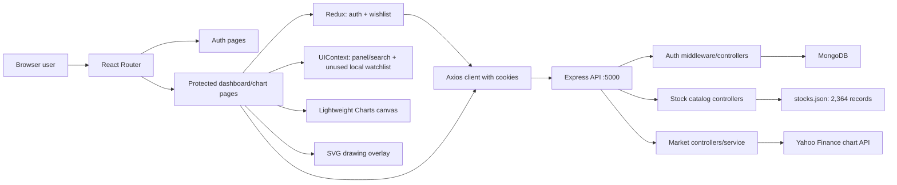
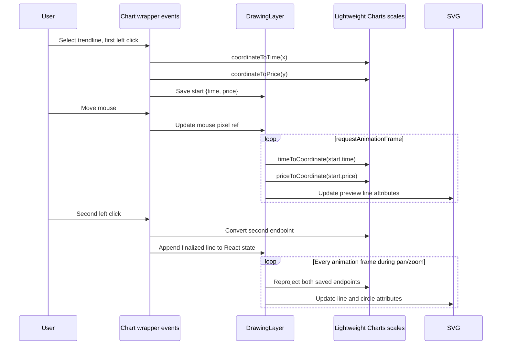
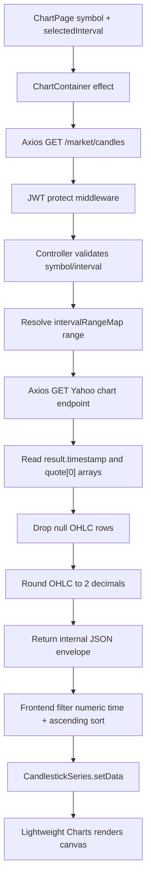

# TradeNotify: Complete Project Audit

Audit date: 2026-06-28

## 1. Executive summary

TradeNotify is a two-part JavaScript application:

- `Frontend/`: React 19 + Vite single-page application.
- `Backend/`: Express 5 REST API with MongoDB/Mongoose persistence.
- Market history: fetched on demand by the backend from Yahoo Finance's chart endpoint.
- Local reference data: 2,364 NSE-oriented symbols stored in `Backend/src/config/stocks.json`.
- Persistent user data: users, hashed passwords, wishlists, and revoked JWTs in MongoDB.
- Browser-only transient data: chart drawings, open/closed panels, search results, selected interval, and loading/error state.

The working implementation provides registration, login/logout, cookie authentication, stock search, a persistent wishlist, historical candlestick charts, interval switching, and two-click trendline drawing. It does **not** currently implement trading/order execution, portfolios, alerts/notifications, live streaming quotes, automated setup detection, strategy management, publishing, chart settings, fullscreen behavior, or persisted drawings. Several of those are mentioned in UI copy or the README but are placeholders or claims rather than implemented features.

## 2. Repository scope and audit method

- Total filesystem entries discovered: 22,024.
- Project-authored/configuration files: 62.
- Excluded from line-by-line application analysis: `.git/` internals and the installed `Backend/node_modules/` and `Frontend/node_modules/` dependency source trees. Those are third-party/generated artifacts; their exact resolved versions are represented by the two lockfiles.
- Backend lockfile: npm lockfile v3, 140 resolved package entries.
- Frontend lockfile: npm lockfile v3, 642 resolved package entries.
- Secrets in `Backend/.env` were deliberately not copied into this report. Only its variable names are documented.

## 3. Architecture and runtime flow



Startup order:

1. Backend loads environment variables, starts an asynchronous MongoDB connection, configures CORS/cookies/JSON parsing, mounts API routers, then listens on `PORT` or 5000.
2. Frontend `main.jsx` mounts React Strict Mode, Redux, `UIProvider`, `BrowserRouter`, and `App`.
3. `App` dispatches `loadUser()`, which calls `GET /api/auth/me` using the JWT cookie.
4. While that request is pending, `ProtectedRoute` shows a spinner. An authenticated user sees the requested protected page and triggers wishlist loading; an unauthenticated user is redirected to `/login`.

## 4. Implemented feature inventory

### Authentication

- Registration accepts `name`, `email`, and `password`.
- Backend checks presence and email uniqueness, hashes the password with bcrypt salt rounds 10, creates the MongoDB user, signs a 30-day JWT, and sends it in an HTTP-only `jwt` cookie.
- Login compares the supplied password with the stored bcrypt hash and returns the same cookie/profile response.
- Session restoration calls `/auth/me`; middleware verifies the cookie, rejects blacklisted tokens, loads the user without `password`, and sets `req.user`.
- Logout adds the token to a blacklist and clears the cookie. Blacklist records expire automatically after 30 days through a MongoDB TTL index.
- In production, the cookie is `secure` and `sameSite: none`; locally it is non-secure and `sameSite: lax`.

### Symbol catalog and search

- The catalog contains 2,364 unique records and no duplicate symbols.
- Record shape: `{ symbol, name, series, isin }`.
- Series distribution: 2,167 `EQ`, 169 `BE`, and 28 `BZ`.
- Symbols have a `.NS` suffix and the UI presents the venue as NSE.
- `GET /api/stocks` returns the first `limit` catalog records.
- `GET /api/stocks/search?q=...` performs case-insensitive substring matching against both name and symbol, preserving JSON file order, then slices to `limit` (default 100).
- The desktop search modal loads 100 initial symbols, waits one second after input, and lets a user navigate to a chart or toggle wishlist membership.
- Keyboard behavior: Alt+S opens search; Escape closes it.

### Wishlist

- Wishlist items are embedded in each user document and store symbol/name plus optional series/ISIN.
- Protected API supports list, append, and removal by symbol.
- Redux owns the actually rendered/persisted wishlist.
- `ProtectedRoute` reloads the wishlist after a user becomes available.
- Search results, the chart star, navbar button, and slide-in watchlist panel are integrated with Redux/API.

### Historical chart

- Protected candle endpoint validates a symbol and an interval.
- Interval-to-range rules:

| Interval | Yahoo range |
|---|---:|
| `1m` | `5d` |
| `2m`, `5m`, `15m`, `30m` | `50d` |
| `1h`, `4h` | `700d` |
| `1d`, `5d`, `1wk` | `5y` |
| `1mo`, `3mo` | `8y` |

- The service calls `https://query1.finance.yahoo.com/v8/finance/chart/{symbol}?interval={interval}&range={range}` with a browser-like User-Agent.
- It validates the Yahoo response, pairs timestamp/open/high/low/close arrays, drops rows containing null OHLC values, rounds prices to two decimals, and emits `{time, open, high, low, close}`.
- Volume, adjusted close, metadata, timezone, pre/post-market data, bid/ask, and quote streaming are not used.
- The React chart filters candles to numeric timestamps, sorts ascending, calls `setData`, and fits content.
- Appearance: dark background, subtle grid, normal crosshair, visible time scale, green up candles, red down candles, fixed 600px chart height, width updated on window resize.
- Data refresh happens only when the component mounts or `symbol`/`interval` changes. There is no polling or WebSocket feed, so “real-time” currently means an on-demand current historical snapshot.

### Drawing engine

- Available modes: cursor and trendline; utility: clear all.
- First left click records chart `{time, price}`; second click creates a line with a `Date.now()` ID.
- Right-click while drawing cancels the unfinished line.
- Drawings are React state in `ChartContainer`, but geometry is rendered imperatively into SVG.
- A continuous `requestAnimationFrame` loop converts saved chart coordinates through `timeToCoordinate` and `priceToCoordinate`, then directly updates SVG line/circle attributes. This keeps lines attached while panning/zooming.
- Drawings survive an interval change while the same `ChartContainer` remains mounted, but they are not saved to MongoDB/local storage and disappear on navigation/refresh. A timestamp unavailable in the new interval causes its line to be hidden.
- There is no selection, dragging, styling, individual deletion, undo/redo, keyboard shortcut implementation, or drawing persistence.

### UI shell

- Dark “trading terminal” visual design with Tailwind, Geist, Lucide icons, glow effects, modal search, fixed navbar, conditional footer, and responsive classes.
- Login/register routes hide navbar/footer and render inside `AuthLayout`.
- Dashboard offers Launch Chart and a visual-only Manage Strategy button.
- Chart header has interval and wishlist controls; Publish, Settings, and Fullscreen buttons are visual-only.

## 5. Route reference

### Browser routes

| Path | Access | Component | Behavior |
|---|---|---|---|
| `/login` | Public | `Login` inside `AuthLayout` | Submits credentials; redirects authenticated user to `/`. |
| `/register` | Public | `Register` inside `AuthLayout` | Creates user; redirects authenticated user to `/`. |
| `/` | Protected | `Dashboard` | Marketing-style landing dashboard and search launch. |
| `/charts/:symbol` | Protected | `ChartPage` | Stock lookup, interval lookup, candles, wishlist star, drawing tools. |

There is no explicit browser 404/catch-all route. `StockDetails` contains a stale navigation target `/chart`, but that component is unused and `/chart` is not registered.

### Backend API routes

| Method and path | Protected | Input | Success output / effect |
|---|---|---|---|
| `GET /api/test` | No | None | Plain text `API is working`. |
| `POST /api/auth/register` | No | JSON `name,email,password` | 201, profile JSON, 30-day JWT cookie. |
| `POST /api/auth/login` | No | JSON `email,password` | 200, profile JSON, 30-day JWT cookie. |
| `POST /api/auth/logout` | No | Optional JWT cookie | Blacklists cookie if present, clears it, returns message. |
| `GET /api/auth/me` | Yes | JWT cookie | User document without password. |
| `GET /api/market/candles` | Yes | Query `symbol`, optional `interval` | `{success,data:{symbol,interval,candles}}`. |
| `GET /api/market/intervals` | Yes | None | Configured interval strings. |
| `GET /api/stocks` | No | Optional query `limit` | First catalog records and count. |
| `GET /api/stocks/search` | No | Query `q`, optional `limit` | Matching records and count. |
| `GET /api/wishlist` | Yes | JWT cookie | Current embedded wishlist. |
| `POST /api/wishlist` | Yes | JSON `symbol,name,series?,isin?` | Adds unique symbol and returns entire wishlist. |
| `DELETE /api/wishlist/:symbol` | Yes | URL symbol | Removes exact symbol and returns entire wishlist. |

## 6. State and data ownership

| Data | Owner | Persistence |
|---|---|---|
| Authenticated profile/loading/error | Redux `auth` slice | Profile reloaded from cookie-backed API after refresh. |
| JWT | Browser HTTP-only cookie | 30 days. Not readable by frontend JavaScript. |
| User/password hash/wishlist | MongoDB `users` collection | Persistent. |
| Revoked tokens | MongoDB `blacklistedtokens` | TTL 30 days. |
| Rendered wishlist | Redux `wishlist` slice | Server-backed. |
| `UIContext.watchlist` | UIContext | Memory only and never synchronized with Redux; effectively unused. |
| Search modal/results/query | UIContext + `SearchBar` state | Memory only. |
| Chart interval/stock lookup/dropdown | `ChartPage` state | Memory only. |
| Candles/loading/error/chart objects | `ChartContainer` state/refs | Memory only; candles sourced from Yahoo per request. |
| Trendlines/tool/drawing gesture | `ChartContainer` + `DrawingLayer` | Memory only. |

## 7. Detailed file-by-file map

### Root

- `README.md` — Product overview, stack, setup instructions, endpoint summary, and a chart/drawing explanation. It has mojibake/encoding artifacts and overstates live data, setup detection, strategy management, and responsiveness details.
- `PROJECT_AUDIT.md` — This audit; added to make the complete map durable and searchable.

### Backend root and configuration

- `Backend/.env` — Local environment values. Keys present: `PORT`, `MONGODB_URI`, `JWT_SECRET`, `NODE_ENV`. Values are intentionally omitted here.
- `Backend/.gitignore` — Ignores `/node_modules` and `.env`.
- `Backend/package.json` — ESM package; only `dev` script (`nodemon server.js`); Express/Mongoose/Axios/JWT/bcrypt/cookie/CORS/dotenv dependencies. No production `start`, test, lint, or format scripts.
- `Backend/package-lock.json` — npm v3 resolution of 140 package entries; generated dependency integrity/version metadata, not application logic.
- `Backend/server.js` — Backend composition root: env, DB connection, CORS, parsers, health route, router mounts, and listener. Allows localhost:5173, `tradenotify.vercel.app`, and any origin ending `.vercel.app`.
- `Backend/src/config/db.js` — Connects Mongoose using `MONGODB_URI`; logs host; terminates process on initial connection failure.
- `Backend/src/config/market.config.js` — Single source of allowed chart intervals and default Yahoo ranges.
- `Backend/src/config/stocks.json` — 2,364 symbol reference records; 14,186 text lines, about 299 KB; schema and distribution documented above.

### Backend models, middleware, controllers, services, routes

- `Backend/src/models/User.js` — User schema with required name/email/password, unique email, timestamps, and embedded wishlist items without subdocument `_id`.
- `Backend/src/models/BlacklistedToken.js` — Unique token plus TTL `createdAt`; supports logout revocation.
- `Backend/src/middlewares/auth.middleware.js` — Reads cookie, checks blacklist, verifies JWT, loads user without password, attaches it to request, otherwise returns 401.
- `Backend/src/controllers/auth.controller.js` — JWT generation, cookie response, registration, login, current-user response, and logout/blacklisting.
- `Backend/src/controllers/market.controller.js` — Validates query/interval, selects range, invokes market service, and shapes candle/interval responses.
- `Backend/src/controllers/stock.controller.js` — Catalog listing and case-insensitive substring search.
- `Backend/src/controllers/wishlist.controller.js` — Validates additions, prevents duplicate symbols, retrieves and mutates the user’s embedded wishlist.
- `Backend/src/services/marketData.service.js` — Yahoo HTTP call, response validation, null filtering, OHLC rounding/transformation, and friendly 404/general errors.
- `Backend/src/routes/auth.routes.js` — Mounts register, login, logout, and protected current-user handlers.
- `Backend/src/routes/market.routes.js` — Mounts protected candles and intervals handlers.
- `Backend/src/routes/stock.routes.js` — Mounts public catalog list and search handlers.
- `Backend/src/routes/wishlist.routes.js` — Applies `protect` to the whole router; mounts list/add/delete handlers.

### Frontend build/configuration/assets

- `Frontend/.gitignore` — Standard Vite log, dependency, build, local env, and editor ignores.
- `Frontend/package.json` — React/Vite scripts and runtime/dev dependencies. Includes Lightweight Charts, Redux Toolkit, Router, Tailwind, Radix/shadcn support, Axios, Lucide, and Geist.
- `Frontend/package-lock.json` — npm v3 resolution of 642 package entries.
- `Frontend/index.html` — Vite HTML shell with root mount, title `tradenotify`, and default Vite favicon.
- `Frontend/vite.config.js` — React plugin and `@` → `src` alias; uses `__dirname` despite ESM configuration, which ESLint flags.
- `Frontend/eslint.config.js` — ESLint recommended, React Hooks, Fast Refresh, browser globals, and strict unused-variable rule.
- `Frontend/postcss.config.js` — Tailwind and Autoprefixer PostCSS plugins.
- `Frontend/tailwind.config.js` — Scans HTML and source JS/TS/JSX/TSX; no custom theme extensions/plugins.
- `Frontend/tsconfig.json` — Enables JS, disables JS checking, and mirrors the `@/*` alias.
- `Frontend/components.json` — shadcn configuration: Radix Nova style, TSX output, Tailwind CSS variables, Lucide icons, aliases.
- `Frontend/README.md` — Unmodified generic Vite template documentation, not TradeNotify-specific.
- `Frontend/public/vite.svg` — Default Vite favicon, referenced by `index.html`.
- `Frontend/src/assets/react.svg` — Default React logo asset; unused.

### Frontend composition, state, and utilities

- `Frontend/src/main.jsx` — Provider hierarchy and application mount.
- `Frontend/src/App.jsx` — Initial auth restoration, global shell, and browser route definitions.
- `Frontend/src/api/axios.js` — Axios instance hard-coded to `http://localhost:5000/api`, with cookies enabled. A deployment URL is commented out.
- `Frontend/src/app/store.js` — Redux store with `auth` and `wishlist` reducers.
- `Frontend/src/features/auth/authSlice.js` — Four async thunks, normalized error extraction, and auth pending/fulfilled/rejected state transitions.
- `Frontend/src/features/wishlist/wishlistSlice.js` — Fetch/add/delete thunks and server-returned-array replacement logic.
- `Frontend/src/hooks/useAuth.js` — Memoized convenience facade over auth selectors/actions.
- `Frontend/src/context/UIContext.jsx` — Search/watchlist panel controls plus a second local watchlist and selected-stock model that are not connected to rendered Redux data.
- `Frontend/src/lib/utils.ts` — `cn()` combines `clsx` and `tailwind-merge` for shadcn components.
- `Frontend/src/index.css` — Tailwind/import setup, Geist, custom scrollbar, and light/dark shadcn CSS variables.

### Frontend pages and active components

- `Frontend/src/pages/Login.jsx` — Controlled login form, Redux error/loading display, redirect after auth, placeholder forgot-password link.
- `Frontend/src/pages/Register.jsx` — Controlled registration form and the equivalent redirect/error/loading flow.
- `Frontend/src/pages/Dashboard.jsx` — Protected page wrapper with navbar top offset and `DashboardLeft`.
- `Frontend/src/pages/ChartPage.jsx` — Reads URL symbol; looks up stock metadata; fetches intervals; owns interval menu; toggles wishlist; renders chart header and chart.
- `Frontend/src/components/AuthLayout.jsx` — Branding/background/card wrapper and nested auth route outlet.
- `Frontend/src/components/ProtectedRoute.jsx` — Auth gate, loading spinner, wishlist bootstrap, protected outlet, and global `WatchlistPanel`.
- `Frontend/src/components/Navbar.jsx` — Conditional global navigation, search, watchlist toggle, user name, and logout. Documentation/Strategy links are placeholders.
- `Frontend/src/components/Footer.jsx` — Conditional footer with dynamic year; Terms/Privacy/Contact links are placeholders.
- `Frontend/src/components/DashboardLeft.jsx` — Hero dashboard. Launch checks the unused UIContext watchlist, so it normally opens search even if Redux wishlist has entries; strategy and metrics are static.
- `Frontend/src/components/SearchBar.jsx` — Desktop-only search launcher/modal, hotkeys, one-second debounce, public catalog calls, chart navigation, and wishlist star controls.
- `Frontend/src/components/WatchlistPanel.jsx` — Right slide-over backed by Redux, with add/search, chart navigation, deletion, loading/error/empty states, and count.
- `Frontend/src/components/ChartContainer.jsx` — Chart lifecycle, candle request/cleaning/rendering, resize, overlays, drawing state, and attribution.
- `Frontend/src/components/DrawingLayer.jsx` — Chart/pixel conversion, drawing gesture, SVG elements, global mouse tracking, and requestAnimationFrame synchronization.
- `Frontend/src/components/DrawingToolbar.jsx` — Cursor/trendline/clear-all UI. Tooltips advertise V/T shortcuts, but no keyboard listeners implement those shortcuts.

### Present but currently unused frontend code

- `Frontend/src/components/Watchlist.jsx` — Older dummy eight-stock list with a nonfunctional search field and dash prices; imported nowhere.
- `Frontend/src/components/StockDetails.jsx` — Static fake Reliance-like OHLC/volume display; navigates to nonexistent `/chart`; imported nowhere.
- `Frontend/src/components/ui/button.tsx` — Generated shadcn variant button abstraction; imported nowhere.
- `Frontend/src/components/ui/card.tsx` — Generated shadcn card component family; imported nowhere.

## 8. End-to-end user flows

### Register/login

1. Form dispatches Redux thunk.
2. Axios sends JSON to Express and accepts/sends credentials.
3. Controller validates, queries MongoDB, hashes/compares password, and signs JWT.
4. Browser stores the HTTP-only cookie; Redux stores returned profile.
5. React effect redirects to `/`; protected shell fetches wishlist.

### Search to chart

1. Navbar search click or Alt+S opens modal.
2. Empty modal requests first 100 JSON catalog records; text requests substring matches after one second.
3. Row click navigates to `/charts/{symbol}`.
4. Chart page separately searches the catalog for metadata and requests allowed intervals.
5. Chart container requests candles; backend validates and proxies Yahoo; chart sorts/renders the transformed response.

### Wishlist

1. Star dispatches add/remove thunk.
2. Protected backend resolves `req.user`, loads full user, mutates embedded array, saves it.
3. API returns the complete new wishlist.
4. Redux replaces `items`, updating modal/chart/panel stars and rows.

### Draw trendline

1. User chooses trendline.
2. First chart click converts pixels to time/price and starts preview.
3. Mouse movement updates a ref; animation frame moves preview endpoint.
4. Second click saves both coordinate endpoints.
5. Every animation frame reconverts endpoints to pixels during chart movement.

## 9. Gaps, defects, and risks found

### High impact

- `auth.controller.js` logs both email **and plaintext submitted password** on invalid login. This is a credential exposure risk and should be removed immediately.
- Frontend API URL is hard-coded to localhost, so a deployed frontend will not reach a deployed API without editing/rebuilding.
- There are no backend tests, frontend tests, rate limits, CSRF controls, request schema validation, password-strength rules, normalized/lowercased email handling, or centralized error middleware.
- CORS permits every hostname ending in `.vercel.app`, which is broader than the named production origin while allowing credentialed requests.

### Functional correctness

- Dashboard Launch Chart reads `UIContext.watchlist`, while the real wishlist is Redux-backed. These stores are unsynchronized.
- `StockDetails` targets `/chart`; the only valid chart route is `/charts/:symbol`.
- README says charts are real-time, but the app fetches one historical snapshot and never polls/subscribes.
- README/UI claim automated setup detection, strategy management, alerts/monitoring, and professional latency, but no corresponding engine/routes/models exist.
- Search query values and delete symbols are interpolated into URLs without `encodeURIComponent` (Axios `params` would be safer).
- Numeric `limit` accepts negative or extreme values; no upper/lower validation is applied.
- Chart metadata lookup uses substring search with limit 1 rather than exact symbol resolution.
- No catch-all UI route, API 404 handler, or Express error handler exists.
- MongoDB connection is started but not awaited before `listen`, allowing early requests before connection completion.
- Logout is public and a duplicate blacklist insertion can produce a 500; the cookie clearing options omit the explicit expiry/path used when setting it.
- Auth middleware does not explicitly reject the case where the JWT is valid but its user was deleted; downstream code may receive `req.user = null`.

### Chart/drawing limitations

- Fixed 600px chart height is not truly container-responsive; only width responds to window resize.
- The continuous drawing animation loop runs even when idle and the effect restarts when drawing state/lines change.
- Drawings are not tied to symbol and are not reset/persisted explicitly; component lifecycle determines what survives.
- Yahoo compatibility/errors for every configured interval (notably synthetic-looking `4h`) are not tested or adapted.
- OHLC values are rounded to two decimals, potentially losing valid precision for low-priced instruments.
- Error retry performs a full page reload rather than retrying the request.

### Code quality and verification

`npm run lint` currently fails with 8 errors and 2 warnings:

- Unused `useRef` and `clearSearch`; React set-state-in-effect and debounce/useCallback findings in `SearchBar.jsx`.
- Missing hook dependencies in `DrawingLayer.jsx`.
- Unused `useEffect` and Fast Refresh mixed-export finding in `UIContext.jsx`.
- Unused catch variable in `authSlice.js`.
- ESM `__dirname` reported undefined in `vite.config.js`.

The production build command was attempted but blocked by the local command-approval layer, so this audit does not claim a successful build. No source code was changed to hide or repair these findings.

### Cleanup/documentation

- Generic Vite README and default Vite/React assets remain.
- Root README contains broken character encoding.
- Four unused component files and several unused UIContext fields increase confusion.
- Many links/buttons are `#` or have no handler.
- Backend lacks a production start command; project lacks root orchestration, sample env, Docker/deployment config, CI, and API schema.

## 10. What this project is—and is not

Today, this is best described as an authenticated **historical NSE chart viewer with symbol search, a persistent watchlist, and basic manual trendlines**. It is not yet a brokerage/trading system: it has no orders, positions, funds, execution, broker integration, risk engine, alerts/notifications, scanner, strategy engine, or live streaming layer.

## 11. Complete technology inventory and exact purpose

### Languages and data formats

| Technology | Where | Exact purpose |
|---|---|---|
| JavaScript (ES modules) | Backend and most frontend files | Controllers, services, Express routing, React components, hooks, Redux logic, configuration. Both packages set `type: module`. |
| JSX | React pages/components | Embeds UI markup in JavaScript and compiles through Vite’s React plugin. |
| TypeScript/TSX | `lib/utils.ts`, generated UI components | Type-safe shadcn utilities/components. The main application remains JavaScript/JSX. |
| JSON | Package metadata, lockfiles, stock catalog, shadcn config, TypeScript config | Dependency/configuration data and bundled stock records. |
| CSS + Tailwind directives | `src/index.css` and JSX classes | Global tokens, font, scrollbar, theme variables, utility-driven component styling. |
| HTML | `Frontend/index.html` | Browser document shell and React mount target. |
| Environment variables | `Backend/.env` | Runtime port, database connection, JWT signing secret, and production/development mode. |

### Frontend runtime technologies

| Technology/package | Version range | How TradeNotify uses it |
|---|---:|---|
| React | `^19.2.0` | Component tree, local state, effects, refs, contexts, event handlers, and conditional rendering. |
| React DOM | `^19.2.0` | `createRoot` mounts the application into `#root`. |
| React Router DOM | `^7.14.2` | `BrowserRouter`, nested route layouts, `Routes`, `Route`, `Outlet`, protected redirects, links, URL parameters, navigation, and location-based navbar/footer hiding. |
| Redux Toolkit | `^2.11.2` | `configureStore`, `createSlice`, and `createAsyncThunk` for auth and wishlist server state. |
| React Redux | `^9.2.0` | `<Provider>`, `useSelector`, and `useDispatch` connect React to Redux. |
| Axios | `^1.15.2` | Shared HTTP client pointed at `/api`, including cookies with `withCredentials: true`. |
| Lightweight Charts | `^5.2.0` | TradingView’s high-performance financial chart engine. It creates and manages the chart canvases, time scale, price scale, crosshair, and candlestick series. |
| Lucide React | `^1.11.0` | All interface icons: activity, search, star, trendline, loader, navigation, etc. |
| Tailwind CSS | `^3.4.19` | Utility classes for layout, spacing, color, responsive behavior, effects, typography, and interaction states. |
| Geist variable font | `^5.2.8` | Global UI typography imported from CSS. |
| Radix UI / shadcn | `radix-ui ^1.4.3`, `shadcn ^4.5.0` | Generated primitive-compatible Button/Card foundation and style setup. Those generated components are present but are not used by active screens. |
| class-variance-authority | `^0.7.1` | Declares Button visual variants and sizes in the unused generated button component. |
| clsx | `^2.1.1` | Conditionally combines class names inside `cn()`. |
| tailwind-merge | `^3.5.0` | Resolves conflicting Tailwind classes inside `cn()`. |
| tw-animate-css | `^1.4.0` | Animation utility definitions imported globally and used by modal/dropdown animation classes. |

### Frontend build and development technologies

| Technology | Purpose |
|---|---|
| Vite `^7.3.1` | Development server, module graph, hot module replacement, and production bundling. |
| `@vitejs/plugin-react` | React JSX transformation and Fast Refresh integration. |
| ESLint 9 | Static analysis with recommended JavaScript rules. |
| React Hooks ESLint plugin | Checks hook call rules, dependencies, and React 19 patterns. |
| React Refresh ESLint plugin | Enforces Fast Refresh-safe exports. |
| PostCSS | CSS transformation pipeline. |
| Autoprefixer | Adds browser vendor prefixes where needed. |
| TypeScript configuration/types | Supports the two TSX/TS utility files and editor resolution, without checking the JavaScript application. |

### Backend technologies

| Technology/package | Version range | How TradeNotify uses it |
|---|---:|---|
| Node.js | README requires 18+ | Executes the ESM backend and performs external/server I/O. Actual package versions may require a newer compatible Node release. |
| Express | `^5.2.1` | HTTP server, middleware chain, route mounting, request parsing, controllers, and responses. |
| MongoDB | External service | Persistent store for user documents, embedded wishlists, and token blacklist records. |
| Mongoose | `^9.5.0` | MongoDB connection, schema/model definitions, queries, saves, unique constraints, timestamps, selection, and TTL index declaration. |
| JSON Web Token | `jsonwebtoken ^9.0.3` | Signs `{id}` claims for 30 days and verifies authentication cookies. |
| bcryptjs | `^3.0.3` | Creates salt with cost 10, hashes registration passwords, and compares login passwords. It is pure JavaScript bcrypt. |
| cookie-parser | `^1.4.7` | Populates `req.cookies`, allowing middleware/controllers to read the `jwt` cookie. |
| CORS | `^2.8.6` | Allows configured browser origins and credentialed cookie requests. |
| dotenv | `^17.4.2` | Loads `.env` values into `process.env`. |
| Axios | `^1.15.2` | Server-side Yahoo Finance HTTP request with a custom User-Agent. |
| Nodemon | `^3.1.14` | Development-only server restart when backend files change. |

### External platforms and APIs

| Platform | Use |
|---|---|
| Yahoo Finance chart API | Supplies historical OHLC timestamps and prices. It is called by the backend, not directly by the browser. |
| TradingView Lightweight Charts | Open-source chart library used locally; “Powered by TradingView” attribution links to TradingView. This is not an embedded TradingView website widget. |
| MongoDB Atlas or local MongoDB | Expected database deployment. |
| Vercel origins | Backend CORS recognizes the named production frontend and all `.vercel.app` subdomains. No deployment configuration exists in this repository. |

## 12. Feature implementation matrix

| Feature | Status | Technologies and implementation |
|---|---|---|
| Register | Implemented | React form → Redux async thunk → Axios → Express → Mongoose → bcrypt → JWT HTTP-only cookie. |
| Login | Implemented | Same stack; bcrypt compare and profile response. Contains a password logging defect on invalid credentials. |
| Restore session | Implemented | `App` effect → `loadUser` thunk → cookie → JWT middleware → MongoDB user query. |
| Logout/revocation | Implemented | Express controller saves token to MongoDB blacklist with TTL and clears cookie. |
| Protected pages | Implemented | React `ProtectedRoute` plus backend `protect` middleware. |
| Symbol list/search | Implemented | Static JSON catalog, Express substring filtering, Axios, React modal. |
| Search debounce | Implemented | One-second JavaScript timer wrapper; not a third-party debounce package. |
| Search keyboard shortcut | Implemented | Window `keydown`: Alt+S and Escape. |
| Persistent wishlist | Implemented | Redux Toolkit frontend and embedded Mongoose user array. |
| Historical candlestick chart | Implemented | Yahoo OHLC → backend transform → Lightweight Charts `CandlestickSeries`. |
| Multiple chart intervals | Implemented | Backend configuration map plus React dropdown; provider compatibility is not guaranteed for every configured value. |
| Chart zoom/pan/crosshair | Implemented by library | Lightweight Charts supplies native pointer interaction and scales. |
| Trendline drawing | Implemented, basic | Two clicks, coordinate conversion, React state, SVG overlay, animation-frame synchronization. |
| Clear all drawings | Implemented | Replaces drawing array with `[]`. |
| Cancel unfinished drawing | Implemented | Context-menu/right-click resets current start point. |
| Persist/share drawings | Not implemented | No API, model, local storage, serialization, or publish handler. |
| Individual drawing edit/delete | Not implemented | SVG uses `pointer-events: none`; no selection model. |
| Live streaming quotes | Not implemented | No WebSocket/SSE/polling. Each chart request is a snapshot. |
| Volume chart/indicators | Not implemented | Backend discards volume; no indicator series or calculations. |
| Notifications/alerts | Not implemented | Despite project name, no notification model, worker, scheduler, email, SMS, push, or alert rule exists. |
| Institutional setup detection | Claimed only | UI/README text exists; there is no detection algorithm or data pipeline. |
| Strategy management | Placeholder | Dashboard button and navbar text only. |
| Publish/share | Placeholder | Chart button has no handler. |
| Chart settings | Placeholder | Icon button has no handler. |
| Fullscreen | Placeholder | Icon button has no handler or Fullscreen API call. |
| Forgot password | Placeholder | `href="#"`; no token/email/reset routes. |
| Documentation/legal/contact | Placeholder | `href="#"`. |
| Trading/orders/portfolio/P&L | Not implemented | No broker integration, order model, execution, holdings, funds, or trade APIs. |

## 13. Redux state, thunks, reducers, and update flow

Redux is used for data shared across routes/components and synchronized with the backend. It is not used for every UI value.

### Store structure

```js
{
  auth: {
    user: null | { _id, name, email, ... },
    loading: boolean,
    error: null | string
  },
  wishlist: {
    items: Array<{ symbol, name, series?, isin? }>,
    loading: boolean,
    error: null | string
  }
}
```

`configureStore` automatically includes Redux’s development checks and thunk middleware. No custom middleware, persistence enhancer, RTK Query API, selector library, or browser local-storage synchronization is configured.

### Authentication async thunks

| Thunk/action prefix | HTTP operation | Fulfilled payload |
|---|---|---|
| `auth/register` | `POST /auth/register` | Profile response. |
| `auth/login` | `POST /auth/login` | Profile response. |
| `auth/loadUser` | `GET /auth/me` | MongoDB user JSON without password. |
| `auth/logout` | `POST /auth/logout` | `null`. |

Authentication reducer behavior:

- Register/login pending: sets `loading=true`, clears previous error.
- Register/login fulfilled: sets `loading=false`, assigns returned profile to `user`.
- Register/login rejected: sets `loading=false`, stores normalized error text.
- Load pending: sets `loading=true`.
- Load fulfilled: sets `loading=false`, stores loaded user.
- Load rejected: sets `loading=false`, clears user. The intentional “not authenticated” failure is not shown as an auth-page error.
- Logout fulfilled: clears user and loading.
- Synchronous `clearError`: sets `error=null`; login/register call it before submit and on unmount.
- Logout rejected has no reducer case, so a failed logout does not update auth state visibly.

### Wishlist async thunks

| Thunk/action prefix | HTTP operation | Fulfilled payload |
|---|---|---|
| `wishlist/fetchWishlist` | `GET /wishlist` | Complete wishlist array. |
| `wishlist/addToWishlist` | `POST /wishlist` | Complete updated wishlist array. |
| `wishlist/removeFromWishlist` | `DELETE /wishlist/{symbol}` | Complete updated wishlist array. |

Wishlist reducer behavior:

- Fetch pending: sets `loading=true`, clears error.
- Fetch fulfilled: sets `loading=false`, replaces `items` with server array.
- Fetch rejected: sets `loading=false`, stores error.
- Add pending: clears error but deliberately does not set `loading=true`.
- Add fulfilled: replaces entire `items` array.
- Add rejected: stores error.
- Remove fulfilled: replaces entire `items` array.
- Remove rejected: stores error.
- Synchronous `clearWishlistError`: exists but is never dispatched by current UI.
- There are no optimistic updates; star/list changes wait for the server response.

### Redux consumers

- `useAuth` hides dispatch/select boilerplate and exposes `login`, `register`, `logout`, `load`, and `resetError` callbacks.
- `ProtectedRoute` reads auth and dispatches wishlist fetch after authentication.
- `SearchBar` reads wishlist membership and dispatches add/remove.
- `WatchlistPanel` reads list/loading/error and dispatches removal.
- `ChartPage` reads membership and dispatches add/remove.
- `Navbar`, `Login`, and `Register` consume auth through `useAuth`.

### Redux versus UIContext versus component state

- Redux: server-backed auth and wishlist.
- UIContext: whether search/watchlist panels are open. It also contains a redundant local watchlist and selected stock that active code does not synchronize or use correctly.
- Component state: form fields, search results/query, chart interval/menu, stock metadata, chart loading/error/tool/lines, and the in-progress drawing point.
- Refs: chart DOM container, SVG elements, chart/series instances indirectly, mouse pixels, and animation-frame identity. Refs support imperative APIs without causing a React render for every mouse move.

## 14. Chart rendering internals: canvas plus SVG

The chart uses **both canvas and SVG**, with different responsibilities.

### Canvas layer: Lightweight Charts

`createChart(chartContainerRef.current, options)` asks Lightweight Charts to create its internal DOM/canvas rendering layers inside the supplied `<div>`. The project does not manually obtain a Canvas 2D context or draw candles itself. The library owns:

- candlestick body and wick rendering;
- time axis and conversion between Unix timestamps and horizontal coordinates;
- price axis and conversion between prices and vertical coordinates;
- crosshair and labels;
- panning, scrolling, and zooming;
- redraw optimization.

The project calls:

```js
candlestickSeries = chart.addSeries(CandlestickSeries, options)
candlestickSeries.setData(cleanData)
chart.timeScale().fitContent()
```

The candle contract is:

```js
{
  time: 1710000000, // Unix seconds
  open: 100.25,
  high: 102.10,
  low: 99.80,
  close: 101.75
}
```

### SVG layer: project-authored drawings

`DrawingLayer` renders an absolutely positioned `<svg>` above the chart. It contains:

- one `<line>` for the unfinished preview;
- one `<g>` per finalized drawing;
- a `<line>` and two endpoint `<circle>` elements inside each group;
- a glow filter;
- `pointer-events-none`, allowing native chart mouse interaction to continue.

React creates/removes the SVG element structure when the `lines` array changes. The animation loop directly changes numeric SVG attributes for speed, instead of using React state on every chart frame.

### Pixel-to-market coordinate calculation

For a mouse event:

1. Read the chart wrapper rectangle with `parent.getBoundingClientRect()`.
2. Calculate local pixels:

```js
x = event.clientX - rect.left
y = event.clientY - rect.top
```

3. Convert horizontal pixel to chart time:

```js
time = chart.timeScale().coordinateToTime(x)
```

4. Convert vertical pixel to series price:

```js
price = series.coordinateToPrice(y)
```

5. Save `{time, price}` rather than `{x, y}`. This is crucial: fixed pixels would stay on the screen while candles move, whereas market coordinates stay conceptually attached to the data.

### Market-to-pixel coordinate calculation

On every animation frame, each saved endpoint is projected back to the current screen:

```js
x = chart.timeScale().timeToCoordinate(savedTime)
y = series.priceToCoordinate(savedPrice)
```

Then the code writes:

```js
line.setAttribute('x1', p1.x)
line.setAttribute('y1', p1.y)
line.setAttribute('x2', p2.x)
line.setAttribute('y2', p2.y)
```

The endpoint circles receive matching `cx`/`cy`. If any conversion returns `null`—for example, because a timestamp is unavailable/off the resolvable scale—the whole drawing group is hidden.

### Trendline event sequence



The parent wrapper receives mouse events because the SVG itself ignores pointer events. Clicks originating from buttons or `.z-40`/`.z-50` UI are ignored to prevent toolbar/modal interactions from creating lines.

## 15. Complete request and working-flow mechanics

### Application bootstrap flow

1. Browser downloads the Vite bundle and `main.jsx` mounts providers.
2. Redux store becomes available to all descendants.
3. UIContext becomes available for modal/panel state.
4. Router selects a route.
5. `App` mounts and dispatches `loadUser` once. React Strict Mode may exercise development lifecycle behavior more than once.
6. Axios sends `GET /api/auth/me` with browser cookies.
7. Express parses cookies, blacklist-checks the token, verifies signature/expiration, and queries MongoDB.
8. Redux changes `loading` to false.
9. Router either renders a protected route or redirects to login.

### Backend middleware order

For a normal API request, processing order is:

1. CORS origin validation and credential headers.
2. Cookie parsing into `req.cookies`.
3. JSON body parsing into `req.body`.
4. Matching mounted router.
5. Route-level or router-level `protect` middleware where configured.
6. Controller.
7. Mongoose or market service as needed.
8. JSON/plain-text response.

There is no centralized final 404/error middleware, request logger, compression, helmet/security-header middleware, or rate limiter.

### Candle data flow in exact transformations



There is no market-data database or cache between Yahoo and the browser. Reopening/changing the interval creates another external request.

### Persistence boundaries

- Browser cookie persists identity; frontend cannot inspect JWT because it is HTTP-only.
- MongoDB persists accounts/wishlists/revocation.
- The stock catalog persists in the repository and is loaded as a Node JSON module.
- Yahoo remains source of truth for candles.
- Redux and React memory disappear on refresh and are reconstructed only where API bootstrap logic exists.
- Drawings are lost permanently on refresh/navigation because no reconstruction API/storage exists.

## 16. Small implementation details that affect behavior

- React Strict Mode is enabled only in the frontend entry tree and helps expose unsafe development behavior.
- Search launcher is hidden below Tailwind’s `md` breakpoint; Alt+S can still invoke the context state, but the `SearchBar` component’s entire wrapper is `hidden md:block`, making the rendered modal unavailable on small screens through that component.
- Navbar is fixed at 64px; protected pages compensate with `pt-16`. Watchlist height is calculated as viewport minus 64px.
- Footer remains present below the chart page because only login/register hide it.
- Wishlist removal compares exact case-sensitive symbols; additions prevent exact duplicate symbols only.
- User email uniqueness depends on exact stored value and MongoDB unique index; `Trader@x.com` and `trader@x.com` may be treated separately depending on collation because no normalization is done.
- JWT payload contains only database user ID; role/permissions do not exist.
- Auth response after login/register uses a small profile, while `/me` returns the wider Mongoose document (including wishlist/timestamps unless serialization defaults omit something). Redux user shape can therefore differ after reload.
- Search results use array index in the React key in addition to symbol even though catalog symbols are unique.
- Interval fetch has a local fallback of `1m,5m,15m,1h,1d` if the protected API fails; the error is only logged.
- Candle and interval endpoints both require auth, while stock list/search do not.
- Wishlist panel is mounted on every protected page even while translated off-screen.
- The chart instance is removed during effect cleanup, preventing library DOM/resource leakage when symbol/interval changes or the page unmounts.
- Window resize updates chart width only; no `ResizeObserver` is actually used despite the README wording.
- The chart logs API response details and candle count to the browser console.
- Tooltips display Trendline `(T)` and Cursor `(V)`, but these keys have no implementation.
- The SVG glow filter ID is global in the document; only one chart is currently rendered, so collision is not presently visible.
- Drawing IDs use current milliseconds; two finalized lines in the same millisecond are theoretically capable of colliding.
- `Date.now()` IDs, chart instances, and SVG nodes are implementation details only and are never sent to the backend.
