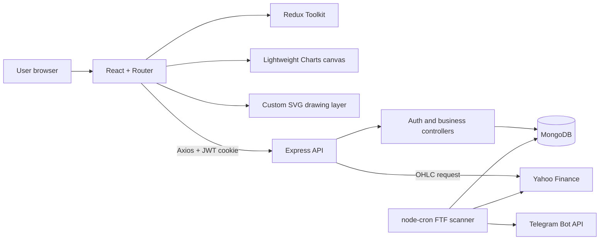
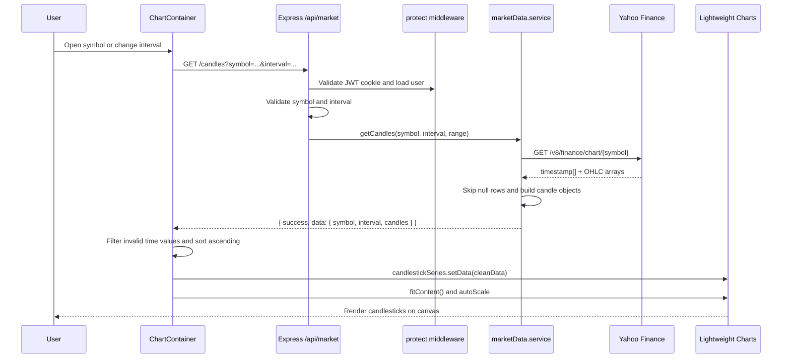
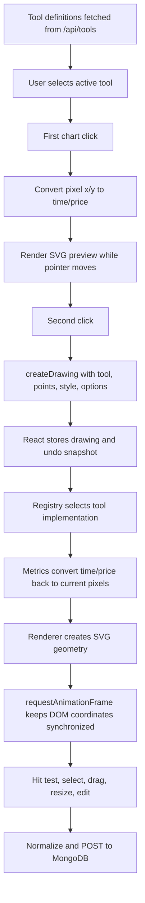
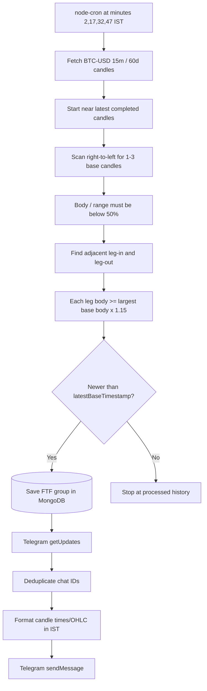

# TradeNotify

TradeNotify is a full-stack market-analysis dashboard for viewing historical candlestick data, searching stocks/crypto/forex, maintaining a personal watchlist, drawing technical-analysis objects over charts, and detecting Follow The Footprint (FTF) base-candle setups in the backend.

The browser renders price candles with TradingView Lightweight Charts and renders project-owned drawing tools in a synchronized SVG layer above the chart. Express obtains OHLC data from Yahoo Finance, MongoDB stores user data and drawings, and a scheduled FTF scanner can notify Telegram users when it detects a new base-candle group.

> TradeNotify is an analysis application. It does not place orders, connect to a broker, stream live ticks, or provide financial advice.

## Contents

- [Features](#features)
- [Technology stack](#technology-stack)
- [System architecture](#system-architecture)
- [Project structure](#project-structure)
- [Complete application flow](#complete-application-flow)
- [Candle fetching and chart rendering](#candle-fetching-and-chart-rendering)
- [SVG drawing-tool system](#svg-drawing-tool-system)
- [Drawing storage and preferences](#drawing-storage-and-preferences)
- [FTF scanner and Telegram notifications](#ftf-scanner-and-telegram-notifications)
- [Database models](#database-models)
- [API reference](#api-reference)
- [Local setup](#local-setup)
- [Scripts and verification](#scripts-and-verification)
- [Deployment notes](#deployment-notes)
- [Current limitations](#current-limitations)

## Features

TradeNotify is built around six core capabilities. Each one follows a simple pattern: discover an asset, view its history, analyze it visually, and optionally save or notify about the result.

### 1. Authentication and secure access

- What it does: lets users create accounts, sign in, stay signed in, and access protected pages safely.
- How it works: the frontend sends credentials to the backend, which hashes passwords with bcrypt and issues a JWT stored in an HTTP-only cookie. The auth middleware validates the token on every protected request and checks a MongoDB blacklist on logout.
- Working flow: a user registers or logs in -> the backend creates or verifies the account -> a signed token is attached to the browser cookie -> the app restores the session with `/api/auth/me` -> protected routes become available -> logging out revokes the token and clears the session.

### 2. Market search and asset discovery

- What it does: helps users quickly find stocks, crypto, and forex assets from the built-in catalogs.
- How it works: the search UI sends a debounced request to the backend, which reads the matching JSON catalog and returns relevant symbols and names.
- Working flow: the user opens the search panel -> enters a symbol or name -> the request is sent after a short delay -> the backend filters the catalog -> matching assets appear in the list -> selecting one opens the chart page for that symbol.

### 3. Watchlist management

- What it does: lets users save favorite assets for fast access later.
- How it works: the watchlist is stored in the user document in MongoDB, so it is personal to each account and can be updated without affecting other users.
- Working flow: the user clicks the star next to an asset -> the frontend sends the add/remove request -> the backend updates the user's watchlist array -> the UI refreshes immediately -> the asset appears in the watchlist panel for future use.

### 4. Candle charting and market analysis

- What it does: displays historical OHLC price data so users can study market movement over time.
- How it works: the chart page requests candles from the backend, the backend fetches data from Yahoo Finance, and the frontend renders the result as candlesticks in Lightweight Charts.
- Working flow: the user selects a symbol and interval -> the backend fetches the relevant historical data -> the data is cleaned and formatted -> the chart populates with candles -> the user can zoom, pan, inspect crosshair values, and compare price structure across time.

### 5. Drawing tools for technical analysis

- What it does: allows users to draw trendlines, ranges, position setups, and Fibonacci levels directly on the chart.
- How it works: the app uses an SVG layer above the chart so drawings can be interactive and stay aligned with market price/time. Each drawing is stored using time/price coordinates rather than screen pixels, which makes it move correctly when the chart is zoomed or panned.
- Working flow: the user selects a drawing tool -> clicks the chart to place the first point -> moves the pointer to preview the shape -> clicks again to finish it -> the drawing is added to the chart state -> the user can drag, resize, edit style, and save it to MongoDB.

### 6. FTF scanning and Telegram alerts

- What it does: automatically scans for Follow The Footprint base-candle patterns and notifies users through Telegram.
- How it works: a scheduled backend job runs at fixed intervals, loads recent candles, checks the base-candle rules, saves any new valid group in MongoDB, and sends a Telegram message to the bot’s known chat IDs.
- Working flow: the scheduler wakes up -> the scanner loads recent market candles -> it tests the base-candle pattern and leg conditions -> a new valid group is stored when it has not been processed before -> the backend sends a structured alert to Telegram for review.

## Technology stack

### Frontend

| Technology | Purpose |
|---|---|
| React 19 | Component UI and local chart/drawing state |
| Vite 7 | Development server and production build |
| React Router 7 | Public and protected routes |
| Redux Toolkit / React Redux | Authentication, watchlist, tool definitions, preferences, and active-tool state |
| Axios | Credentialed calls to the Express API |
| Lightweight Charts 5 | Candlestick canvas, axes, crosshair, zoom/pan, and coordinate conversion |
| SVG + `requestAnimationFrame` | Custom drawing overlay and chart-synchronized geometry |
| Tailwind CSS 3 | Layout, responsive design, and dark terminal styling |
| Radix UI / shadcn utilities | UI primitive foundation and generated button/card helpers |
| Lucide React | Interface and drawing-toolbar icons |
| Geist Variable | Application font |

### Backend and services

| Technology | Purpose |
|---|---|
| Node.js with ES modules | Backend runtime |
| Express 5 | API server and routing |
| MongoDB / Mongoose 9 | Persistent application data and indexes |
| JSON Web Token | 30-day signed authentication token |
| bcryptjs | Password hashing and comparison |
| cookie-parser | Reads the HTTP-only `jwt` cookie |
| CORS | Credentialed local/Vercel frontend access |
| Axios | Yahoo Finance and Telegram Bot API calls |
| node-cron | FTF scan scheduling |
| dotenv | Backend environment configuration |
| Yahoo Finance chart API | Historical OHLC source |
| Telegram Bot API | Scanner alerts and test notifications |

## System architecture



The frontend and backend have separate `package.json` files. The backend is the only component that contacts Yahoo Finance, MongoDB, or Telegram. The browser calls the backend with `withCredentials: true` so the JWT cookie accompanies protected requests.

## Project structure

```text
TradeNotify/
|-- Backend/
|   |-- server.js                         # Express bootstrap, middleware, routes, cron startup
|   |-- package.json
|   `-- src/
|       |-- config/                       # DB, intervals, FTF rules, asset JSON catalogs
|       |-- controllers/                  # HTTP request/response handlers
|       |-- cron/ftfScanner.cron.js       # 15-minute FTF schedule
|       |-- middlewares/auth.middleware.js
|       |-- models/                       # Mongoose schemas
|       |-- routes/                       # Express route declarations
|       |-- services/
|       |   |-- marketData.service.js     # Yahoo OHLC adapter
|       |   |-- notificationService.js    # Alert formatting/fan-out
|       |   |-- telegramService.js        # Telegram API client
|       |   `-- ftf/baseCandleScanner.js  # FTF detection and persistence
|       |-- utils/                        # FTF math and deep merge
|       `-- seedToolDefinitions.js        # Seeds five drawing definitions
|-- Frontend/
|   |-- package.json
|   |-- vite.config.js
|   |-- tailwind.config.js
|   `-- src/
|       |-- api/axios.js                  # API base URL and credential settings
|       |-- app/store.js                  # Redux store
|       |-- components/                   # Chart, overlay, toolbars, search, watchlist
|       |-- context/UIContext.jsx         # Search/watchlist panel UI state
|       |-- features/                     # Auth, wishlist, drawing-tool slices
|       |-- pages/                        # Dashboard, chart, login, register
|       |-- tools/
|       |   |-- registry/registry.js      # Tool-ID -> implementation mapping
|       |   `-- groups/                   # Metrics, renderer, preview, hit testing
|       `-- utils/                        # Drawing styles, metadata, time resolution
|-- vercel.json                           # SPA fallback rewrite
`-- README.md
```

## Complete application flow

### 1. Startup and authentication

1. `main.jsx` mounts Redux, `UIProvider`, and `BrowserRouter`.
2. `App.jsx` calls `loadUser()`, which requests `GET /api/auth/me`.
3. The browser sends the HTTP-only `jwt` cookie.
4. `protect` checks the token blacklist, verifies the JWT, loads the MongoDB user without the password, and attaches it as `req.user`.
5. `ProtectedRoute` either renders the dashboard/chart or redirects to `/login`.
6. Once authenticated, the app fetches the user's watchlist and merged drawing-tool definitions.

Registration hashes passwords with bcrypt (salt cost 10). Login signs a JWT containing the user ID for 30 days. Logout adds the token to `BlacklistedToken` and clears the cookie; the blacklist document expires after 30 days through a TTL index.

### 2. Asset discovery and watchlist

1. The search modal opens from the navbar/watchlist or with `Alt+S`.
2. The user selects Stocks, Crypto, or Forex.
3. An 800 ms debounced request calls the matching JSON-backed API.
4. Selecting a result navigates to `/charts/:symbol`.
5. Clicking its star adds/removes the asset in the authenticated user's embedded `wishlist` array.

### 3. Chart page

1. `ChartPage` reads `symbol` from the route.
2. It loads the supported intervals, symbol metadata, and saved drawings.
3. `ChartContainer` creates a chart and candlestick series.
4. Changing `symbol` or `interval` recreates the chart and fetches a fresh Yahoo snapshot through the backend.
5. Drawings remain in React state across interval switches and their times are mapped onto candles in the new interval.
6. Save serializes all drawings to MongoDB. Empty save attempts delete the symbol's drawing document.

### 4. Data ownership

| Data | Owner/source | Lifetime |
|---|---|---|
| Authentication token | HTTP-only browser cookie | 30 days unless logged out/expired |
| Users and watchlists | MongoDB `users` | Persistent |
| Revoked JWTs | MongoDB `blacklistedtokens` | TTL: 30 days |
| Tool defaults | MongoDB `tooldefinitions` | Persistent, seeded by script |
| User tool overrides | MongoDB `usertoolpreferences` | Persistent |
| Chart drawings | MongoDB `chartdrawings` | Persistent per user + symbol |
| FTF detections | MongoDB `ftfs` | Persistent per symbol + interval |
| Candle history | Yahoo Finance | Requested on demand; not cached in MongoDB |
| Undo/redo history | React component memory | Lost on navigation/refresh |
| Asset catalogs | Repository JSON files | Updated only with code/data changes |

## Candle fetching and chart rendering

### End-to-end candle flow



### Interval-to-range mapping

The backend rejects intervals not listed in `Backend/src/config/market.config.js` and chooses the Yahoo history range automatically.

| Interval | Yahoo range |
|---|---:|
| `1m` | `5d` |
| `2m`, `5m`, `15m`, `30m` | `50d` |
| `1h`, `4h` | `700d` |
| `1d`, `5d`, `1wk` | `5y` |
| `1mo`, `3mo` | `8y` |

Yahoo ultimately determines whether a particular interval/range combination is available.

### Backend transformation

Yahoo returns parallel arrays. `marketData.service.js` combines indexes into the internal candle contract and drops rows where any OHLC value is `null` (for example, a market halt or incomplete provider row):

```js
{
  time: 1710000000, // Unix seconds
  open: 100.25,
  high: 102.10,
  low: 99.80,
  close: 101.75
}
```

The frontend filters malformed entries, sorts by `time`, and passes the array directly to `CandlestickSeries.setData()`.

### How the chart is drawn

`ChartContainer.jsx` calls `createChart()` on a DOM element and adds one `CandlestickSeries`. Lightweight Charts owns the internal canvas and handles candle bodies/wicks, time and price scales, crosshair, zoom, and pan. TradeNotify configures:

- emerald up candles and red down candles;
- dark background/grid/axes;
- IST time labels;
- symbol-specific price formatting;
- a fixed 600 px chart height;
- `fitContent()` after data load;
- width updates on `window.resize`.

This is snapshot-based historical data. There is no WebSocket, Server-Sent Events, or polling loop for live candle updates.

## SVG drawing-tool system

The chart is a canvas owned by Lightweight Charts. TradeNotify places an absolutely positioned `<svg>` above that canvas. This separation lets the library remain responsible for market rendering while the application owns interactive analysis objects.

### Available tools

| Tool ID | Visual behavior | Main SVG elements |
|---|---|---|
| `trendline` | Line between two market points | transparent hit line, visible line, endpoint circles |
| `pricerange` | Price movement rectangle and directional arrow | rectangle, top/bottom lines, arrow lines |
| `longposition` | Profit above entry and loss below entry | two rectangles, TP/entry/SL lines, five handles |
| `shortposition` | Loss above entry and profit below entry | two rectangles, SL/entry/TP lines, five handles |
| `fibonacciretracement` | Configurable retracement levels and fills | diagonal, level lines, labels, band rectangles, handles |

### Drawing lifecycle



### Coordinates: why drawings remain attached to candles

Mouse input begins in pixels relative to the chart canvas:

```js
time = chart.timeScale().coordinateToTime(x)
price = series.coordinateToPrice(y)
```

The saved point is `{ time, price }`, not `{ x, y }`. During render, the direction is reversed:

```js
x = chart.timeScale().timeToCoordinate(time)
y = series.priceToCoordinate(price)
```

Therefore zooming and panning move a drawing with market data rather than pinning it to the screen. `resolveRenderableTime()` uses binary search to map a stored time to the candle that contains it on the current timeframe, clamping times outside the loaded range to the first/last candle.

### Rendering and interaction internals

- `DrawingLayer` owns pointer events, preview state, drag state, and the animation loop.
- `DrawingRenderer` asks the registry for the selected tool implementation.
- Each implementation supplies `render()` and `hitTest()`; complex tools also supply a React `Renderer` and imperative `updateDom()`.
- React creates/removes the SVG structure when drawings change.
- `requestAnimationFrame` recalculates coordinates and updates SVG attributes directly during zoom, pan, and drag to avoid a React render for every frame.
- Transparent, wider hit lines make thin shapes selectable.
- Endpoint/body handles convert dragged pixels back to time/price.
- Position tools also change TP, entry, SL, left, and right geometry through named handles.
- Right-click cancels an unfinished drawing; `Escape` cancels drawing or clears selection; `Delete`/`Backspace` removes the selected drawing locally.
- The floating toolbar displays metadata and edits supported color/width values.

### How to create another SVG tool

The system separates database configuration from frontend geometry:

1. Create a directory under `Frontend/src/tools/groups/<group>/<tool>/`.
2. Add a metrics module that converts the drawing's market coordinates into SVG coordinates.
3. Add a renderer component for its SVG elements and, when needed, a preview component.
4. Add a `<tool>.tool.js` object exposing `META`, `render`, `hitTest`, and optionally `Renderer`/`updateDom`.
5. Import it and map its tool ID in `Frontend/src/tools/registry/registry.js`.
6. If it needs a special preview or drag behavior, connect that behavior in `DrawingLayer.jsx`.
7. Add its default definition to `Backend/src/seedToolDefinitions.js`, including `style`, `options`, and `supports`.
8. Run the seed script so MongoDB returns the new definition from `GET /api/tools`.
9. Add an icon mapping in `DrawingToolbar.jsx` if no current Lucide mapping fits.

A tool definition resembles:

```js
{
  tool: 'exampletool',
  displayName: 'Example Tool',
  category: 'Examples',
  icon: 'example',
  order: 6,
  enabled: true,
  style: { color: '#3b82f6', width: 2, fillOpacity: 0.16 },
  options: { showLabels: true },
  supports: { color: true, width: true, fillOpacity: true }
}
```

`supports` controls which editing controls are exposed; `style` supplies visual defaults; `options` supplies behavior/geometry defaults. The registry supplies the actual SVG implementation—database definitions alone cannot render a new tool.

## Drawing storage and preferences

### Drawing document flow

1. On symbol change, `ChartPage` calls `GET /api/chart-drawings?symbol=...`.
2. Stored `points[0]` and `points[1]` are converted to frontend `start` and `end` fields.
3. The user creates/edits drawings in React memory and undo/redo snapshots.
4. `SAVE DRAWINGS` normalizes each object and calls `POST /api/chart-drawings/save`.
5. Express validates `symbol`, `interval`, and basic drawing shape, then upserts by `{ userId, symbol }`.

Example persisted drawing item:

```json
{
  "id": "1750000000000",
  "tool": "trendline",
  "points": [
    { "time": 1710000000, "price": 100.25 },
    { "time": 1710000900, "price": 104.80 }
  ],
  "style": {
    "color": "#3b82f6",
    "width": 2,
    "lineStyle": "solid",
    "fillOpacity": 0.16
  },
  "options": {},
  "locked": false,
  "visible": true
}
```

The unique key is user + symbol, not user + symbol + interval. Only one interval string is stored on the document, while all drawings for that symbol are reused on every selected interval.

### Tool preference merge

`ToolDefinition` contains global defaults. `UserToolPreference` stores only a user's overrides. `GET /api/tools` deep-merges default `style`, `options`, and `supports` with the matching override and returns enabled tools ordered by `order`.

Saving from the floating toolbar performs two writes:

- `PATCH /api/tools/:toolId` updates the user's default style/options for future drawings.
- `POST /api/chart-drawings/save` stores the updated style on the existing chart drawing.

## FTF scanner and Telegram notifications

The FTF flow runs when the backend starts successfully and MongoDB is connected.



Important implementation details:

- Schedule: `2-59/15 * * * *`, timezone `Asia/Kolkata` (2 minutes after each 15-minute boundary).
- Current scanner target is hard-coded to `BTC-USD`, interval `15m`, range `60d`.
- A base candle has `abs(close - open) / (high - low) < 0.50`.
- Valid groups contain 1-3 consecutive base candles; longer sequences are rejected.
- Leg-in and leg-out bodies must each be at least 15% larger than the largest base body.
- `latestBaseTimestamp` prevents reprocessing older groups.
- Telegram recipients are inferred from all unique chat IDs visible to the bot through `getUpdates`; there is no subscription collection in MongoDB.
- `MarketZone` and its supply/demand schema exist, but the current scanner saves base groups to `FTF`; it does not yet calculate or persist `MarketZone` records.

## Database models

| Model | Key fields and indexes | Purpose |
|---|---|---|
| `User` | unique `email`; embedded `wishlist[]` | Accounts and saved assets |
| `BlacklistedToken` | unique `token`; 30-day TTL `createdAt` | Logout/revocation |
| `ChartDrawing` | unique `{ userId, symbol }`; `interval`, `drawings[]` | Saved SVG drawing data |
| `ToolDefinition` | unique `tool`; style/options/supports | Global drawing-tool configuration |
| `UserToolPreference` | unique `userId`; per-tool overrides | User drawing defaults |
| `FTF` | unique `{ symbol, interval }`; groups and latest timestamp | Detected base-candle sequences |
| `MarketZone` | unique `{ symbol, interval }`; embedded zones | Supply/demand zone schema reserved for later scanner work |

## API reference

All paths below are relative to the backend origin. Protected endpoints require the `jwt` cookie.

### Health and authentication

| Method | Endpoint | Protected | Description |
|---|---|:---:|---|
| `GET` | `/api/test` | No | Basic API health response |
| `POST` | `/api/auth/register` | No | Create account and set JWT cookie |
| `POST` | `/api/auth/login` | No | Authenticate and set JWT cookie |
| `GET` | `/api/auth/me` | Yes | Restore current user |
| `POST` | `/api/auth/logout` | No | Blacklist current token and clear cookie |

### Assets and candles

| Method | Endpoint | Protected | Description |
|---|---|:---:|---|
| `GET` | `/api/stocks?limit=100` | No | List stock catalog (legacy and generic stock route resolve to the same data) |
| `GET` | `/api/stocks/search?q=rel&limit=100` | No | Search stocks by name/symbol |
| `GET` | `/api/crypto?limit=100` | No | List crypto catalog |
| `GET` | `/api/crypto/search?q=btc&limit=100` | No | Search crypto |
| `GET` | `/api/forex?limit=100` | No | List forex catalog |
| `GET` | `/api/forex/search?q=eur&limit=100` | No | Search forex |
| `GET` | `/api/market/intervals` | Yes | Return supported interval IDs |
| `GET` | `/api/market/candles?symbol=BTC-USD&interval=15m` | Yes | Return cleaned historical OHLC candles |

### Watchlist

| Method | Endpoint | Protected | Description |
|---|---|:---:|---|
| `GET` | `/api/wishlist` | Yes | Return current watchlist |
| `POST` | `/api/wishlist` | Yes | Add `{ symbol, name, series?, isin? }` |
| `DELETE` | `/api/wishlist/:symbol` | Yes | Remove one symbol |

### Drawings and tool configuration

| Method | Endpoint | Protected | Description |
|---|---|:---:|---|
| `GET` | `/api/chart-drawings?symbol=...` | Yes | Load the user's drawings for a symbol |
| `POST` | `/api/chart-drawings/save` | Yes | Upsert all drawings and the current interval |
| `DELETE` | `/api/chart-drawings?symbol=...` | Yes | Delete the symbol's complete drawing document |
| `DELETE` | `/api/chart-drawings/:drawingId?symbol=...` | Yes | Delete one drawing from the document |
| `GET` | `/api/tools` | Yes | Return enabled defaults merged with user preferences |
| `PATCH` | `/api/tools/:toolId` | Yes | Deep-merge user `{ style?, options? }` overrides |
| `GET` | `/admin/tool-definitions` | Yes | Return cached raw definitions; authentication only, no role check |

### Telegram utility

| Method | Endpoint | Protected | Description |
|---|---|:---:|---|
| `GET` | `/api/test/telegram` | No | Send a test message to unique bot chat IDs |

The Telegram test route is intentionally documented as currently implemented: it is public and should be protected or removed before production use.

## Local setup

### Prerequisites

- Node.js `20.19+` (required by the installed Vite and Mongoose versions) or a compatible Node 22 release.
- npm.
- MongoDB locally or through MongoDB Atlas.
- Optional: a Telegram bot token for scanner notifications.

### 1. Install dependencies

```bash
cd Backend
npm install

cd ../Frontend
npm install
```

### 2. Configure the backend

Create `Backend/.env`:

```env
PORT=5000
MONGODB_URI=mongodb://127.0.0.1:27017/tradenotify
JWT_SECRET=replace_with_a_long_random_secret
NODE_ENV=development

# Optional, but required for Telegram sends
TELEGRAM_BOT_TOKEN=123456789:replace_with_bot_token
```

Do not commit `.env` or real credentials.

### 3. Configure the frontend API URL

`Frontend/src/api/axios.js` currently uses the deployed Render backend:

```js
baseURL: 'https://trade-notify-qai3.onrender.com/api'
```

For local development, change it to:

```js
baseURL: 'http://localhost:5000/api'
```

Because authentication uses cookies, keep `withCredentials: true`. The backend already allows `http://localhost:5173` through CORS.

### 4. Seed drawing tools

The toolbar is populated from MongoDB. After configuring the backend environment, run:

```bash
cd Backend
node src/seedToolDefinitions.js
```

The seed is idempotent: it upserts definitions by tool ID.

### 5. Run both applications

Terminal 1:

```bash
cd Backend
npm run dev
```

Terminal 2:

```bash
cd Frontend
npm run dev
```

Open `http://localhost:5173`, register a user, and select an asset.

## Scripts and verification

### Frontend

```bash
npm run dev      # Vite development server
npm run build    # Production bundle
npm run lint     # ESLint
npm run preview  # Preview the production bundle
```

### Backend

```bash
npm run dev      # Nodemon server
npm start        # Node server
```

`Backend/src/services/ftf/baseCandleScanner.test.js` is a direct Node assertion file rather than an npm test script. It imports the real scanner and therefore requires a valid backend environment/database connection:

```bash
node src/services/ftf/baseCandleScanner.test.js
```

## Deployment notes

- `vercel.json` rewrites frontend routes to `index.html` for SPA routing.
- Backend CORS allows `http://localhost:5173`, `https://tradenotify.vercel.app`, and any origin ending in `.vercel.app`.
- Production cookies use `Secure` and `SameSite=None`; frontend requests must use HTTPS and credentials.
- The frontend API base URL is hard-coded, so changing backend environments requires editing/rebuilding the frontend. A `VITE_API_URL` environment variable would make deployments easier.
- The cron job runs inside the API process. On sleeping/serverless/replicated hosting, schedules may be skipped or run multiple times; a dedicated worker/scheduler is safer for production.
- The backend has no centralized error middleware, rate limiting, request logging, or security-header middleware.

## Current limitations

- Market candles are historical request snapshots, not live streamed prices.
- Yahoo responses are not cached, rate-limited, or persisted by TradeNotify.
- Provider support may differ for some configured interval/range combinations.
- Drawings require an explicit save; undo/redo history is not persisted.
- A drawing document is keyed only by user + symbol, so drawings are intentionally shared across intervals and the saved `interval` is only the last saved interval.
- Drawing backend validation checks the basic shape but does not deeply validate every style/option value.
- Publish, settings, and fullscreen buttons are present in the chart header but have no handlers.
- The FTF implementation detects and stores base groups; full supply/demand zone generation, invalidation, trend scoring, and probability enhancement are not connected.
- FTF configuration contains future notification toggles, but the current scanner directly calls Telegram regardless of `FTF_CONFIG.notifications.telegram`.
- Telegram recipient discovery uses bot updates rather than an explicit opt-in subscription model.
- The `/api/test/telegram` route and `/admin/tool-definitions` naming do not provide production-grade authorization boundaries.
- The frontend currently has a hard-coded production API URL.

---

Built by Abhishek Jaiswal.
